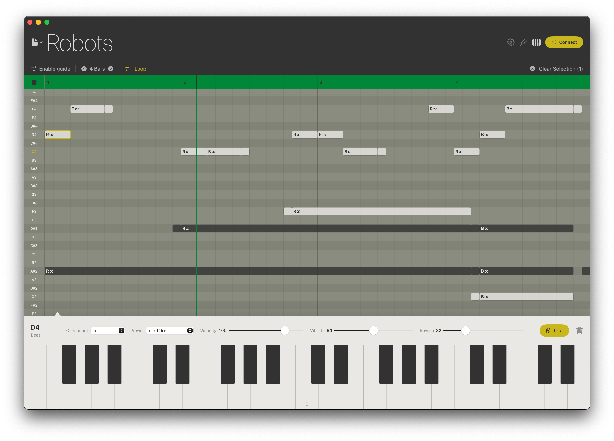

# Choir Arranger

A native macOS app for arranging and performing with [Teenage Engineering's Choir dolls](https://teenage.engineering/products/choir) via Bluetooth MIDI.



## Download

**[Download Choir Arranger v1.0.0](https://github.com/dderuntz/choir-editor/releases/latest/download/ChoirArranger.zip)** — macOS 13+, signed and notarized.

Unzip and drag to Applications. No Xcode or build tools needed.

## Getting Started

### Connect a Doll

Choir dolls must be paired through macOS **Audio MIDI Setup** once before the app can see them:

1. Open **Audio MIDI Setup** (Spotlight → "Audio MIDI Setup").
2. Window → Show MIDI Studio (Cmd+2).
3. Click the **Bluetooth** icon in the toolbar.
4. Wake the doll (press its button).
5. Click **Connect** when it appears (e.g., "CH-8").

Once paired, Choir Arranger detects the doll automatically.

### Using the Sequencer

| Action | How |
|---|---|
| Add a note | Click on the grid |
| Move a note | Drag it |
| Resize a note | Drag its right edge |
| Duplicate a note | Option-drag |
| Select multiple notes | Shift-click |
| Move a group | Drag any selected note |
| Edit a group | Change any inspector parameter — applies to all selected |
| Delete | Select and press Delete |
| Play / Stop | Click the play button or press Space |
| Scrub | Click or drag the transport bar |
| Scale guide | Toggle in the toolbar — hatches out-of-key rows |
| Save / Open | Cmd+S / Cmd+O, or use File → Open Recent |
| Appearance | View menu → Light, Dark, or System |

### Note Inspector

Each note carries five parameters that control the Choir doll's voice:

- **Consonant** — the attack sound (None, B, D, G, H, L, M, N, R, S, T, W, Y, Random)
- **Vowel** — the sustained sound (Ah, Eh, Ee, Oh, Oo, Random)
- **Velocity** — how loud (0–127)
- **Vibrato** — pitch modulation depth (0–127, default 64)
- **Reverb** — room effect (0–127, default 32)

### Local Audio

A built-in synthesizer lets you hear playback without a connected doll. It plays a triangle wave with pitch vibrato and reverb that respond to each note's settings. Toggle it in the app settings.

### Keyboard

The bottom keyboard lets you play notes live. Clicking a key scrolls the grid to that pitch. Middle C is highlighted.

## Feedback

Found a bug or have a feature request? [Open an issue](https://github.com/dderuntz/choir-editor/issues).

## Building from Source

Requires macOS 13+ and Xcode 15+.

```bash
swift run
```

Or use the Xcode project in `Choir Arranger/`.

## Credits

- Protocol research: [jetztgradnet/Choirama](https://github.com/jetztgradnet/Choirama)
- Hardware: [Teenage Engineering Choir](https://teenage.engineering/products/choir)
